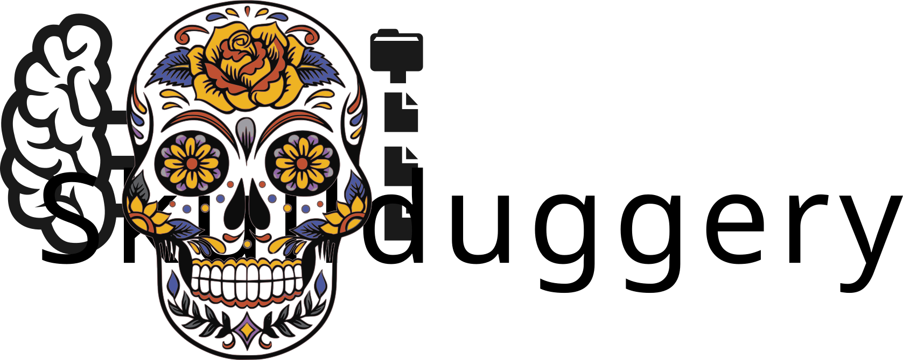

# Skullduggery



**Skullduggery** is a BIDS app for automated defacing of anatomical MRI images. It removes identifiable facial features from anatomical neuroimaging data while preserving brain tissue, protecting participant privacy in neuroimaging studies.

## Features

- **Automated defacing** - Uses template-based registration and hard-coded anatomical markers
- **Age-specific templates** - Supports pediatric cohorts with age-based template selection from TemplateFlow
- **BIDS-compatible** - Full integration with BIDS datasets and metadata
- **Multi-series support** - Process multiple anatomical series in a single run
- **Quality assurance** - Generates HTML reports with mosaic visualizations
- **DataLad integration** - Optional support for git-annex metadata tracking
- **Flexible filtering** - Select specific participants/sessions with BIDS filters

## Installation

### Basic Installation
```bash
pip install skullduggery
```

### With DataLad Support
For optional git-annex metadata tracking:
```bash
pip install skullduggery[datalad]
```

### Development Installation
```bash
pip install -e ".[test]"
```

## Quick Start

### Deface Your First Dataset
```bash
skullduggery /path/to/bids/dataset --participant-label 01 --report-dir ./reports
```

### Process Multiple Participants
```bash
skullduggery /path/to/bids/dataset \
  --participant-label 01 02 03 \
  --save-all-masks \
  --report-dir ./defacing_reports
```

### For Pediatric Data
```bash
skullduggery /path/to/bids/dataset \
  --template MNIInfant:cohort-06m09m \
  --report-dir ./pediatric_reports
```

## Documentation

Complete command-line documentation is available in the [Usage Guide](docs/usage.md) and [Examples](docs/examples.md).

- **Getting Started** - Quick overview and your first command
- **Usage Guide** - All command-line options explained
- **Command Reference** - Quick lookup for flags and arguments
- **Examples** - 12 real-world scenarios with complete commands

View the full documentation at: `docs/` or [online](https://readthedocs.org/)

## Command-Line Options

### Required Arguments
- `BIDS_PATH`: Path to the BIDS dataset directory

### Optional Arguments
- `--participant-label` - Process specific participants (space-separated IDs, prefix 'sub-' optional)
- `--session-label` - Process specific sessions (space-separated IDs, prefix 'ses-' optional)
- `--template` - TemplateFlow template name (default: `MNI152NLin6Asym`)
- `--default-age VALUE:UNIT` - Fallback age for participants missing age data (e.g., `5:years`)
- `--save-all-masks` - Save defacing masks for all series (default: only reference series)
- `--report-dir DIR` - Directory for HTML reports and visualizations
- `--ref-bids-filters JSON` - BIDS filters for selecting reference image (default: `{"suffix": "T1w", "datatype": "anat"}`)
- `--other-bids-filters JSON` - BIDS filters for images to deface (default: `[{"datatype": "anat"}]`)
- `--datalad` - Enable DataLad integration for metadata tracking
- `--deface-sensitive` - Only deface images marked with distribution-restrictions metadata
- `--force-reindex` - Force pyBIDS database reindexing
- `--debug LEVEL` - Set logging level (default: `info`)

## How It Works

The defacing pipeline follows these steps:

1. **Template Selection** - Loads appropriate template from TemplateFlow (age-specific if available)
2. **Reference Registration** - Registers participant's reference image to template space
3. **Mask Warping** - Warps template-space defacing mask to participant's native space
4. **Series Defacing** - Applies mask to all anatomical series for the participant
5. **Report Generation** - Creates HTML reports with QA visualizations
6. **Optional Commit** - Saves changes to DataLad repository if enabled

## Preprocessing Requirements

Before running skullduggery, ensure your dataset:
- Follows the BIDS standard
- Contains valid `participants.tsv` (with optional age column for pediatric templates)
- Has anatomical images in proper BIDS format

## Output Files

Skullduggery creates:
- **Defaced images** - In-place modification of anatomical NIfTI files
- **Defacing masks** - `*desc-deface_mask.nii.gz` files (if requested)
- **Transformation matrices** - `*_from-T1w_to-<template>_xfm.mat` files
- **HTML reports** - With registration and defacing visualizations
- **Metadata** - DataLad metadata updates (if enabled)

## Examples

### Process All Participants
```bash
skullduggery /data/mybids
```

### Process Specific Pediatric Cohort
```bash
skullduggery /data/mybids \
  --participant-label 001 002 003 \
  --template MNIInfant \
  --default-age 6:months
```

### Generate Detailed Reports
```bash
skullduggery /data/mybids \
  --save-all-masks \
  --report-dir ./qa_reports \
  --debug debug
```

### With Distribution Restrictions Filtering
```bash
skullduggery /data/mybids \
  --deface-sensitive \
  --datalad
```

## Documentation

- [Developer Guide](docs/developer.md) - Development setup and guidelines
- [VSCode Setup](docs/vscode.md) - Visual Studio Code configuration
- [API Documentation](docs/modules.rst) - Detailed API reference

## Contributing

See [CONTRIBUTING.md](CONTRIBUTING.md) for guidelines on reporting issues and contributing code.

## License

This project is licensed under the MIT License. See [LICENSE](LICENSE) for details.

## Citation

If you use Skullduggery in your research, please cite:

```bibtex
@software{skullduggery,
  title={Skullduggery: Automated Defacing of Neuroimaging Data},
  author={Pinsard, Basile},
  url={https://github.com/UNFmontreal/skullduggery},
  year={2024}
}
```

## Support

For issues, questions, or suggestions, please open an issue on [GitHub](https://github.com/UNFmontreal/skullduggery/issues).
