# Developer Guide

## Quick Start

```bash
# Clone and setup
git clone https://github.com/UNFmontreal/skullduggery.git
cd skullduggery
python -m venv venv
source venv/bin/activate
pip install -e ".[test,datalad]"
```

## Project Structure

```
skullduggery/
├── src/skullduggery/
│   ├── run.py              # CLI entry point
│   ├── workflow.py         # Main defacing pipeline
│   ├── align.py            # ANTs registration
│   ├── mask.py             # Mask generation
│   ├── bids.py             # BIDS utilities
│   ├── template.py         # Template handling
│   ├── report.py           # Report generation
│   └── utils.py            # Helpers
├── tests/                  # Unit tests
├── docs/                   # Documentation
└── pyproject.toml          # Project config
```

## Workflow Architecture

The defacing workflow orchestrates a multi-stage registration and masking pipeline:

```mermaid
flowchart TD
    Start([Load BIDS Dataset]) --> SetupTpl["Generate Template Mask<br/>in Template Space MNI"]
    SetupTpl --> FindRef["Find All Reference<br/>Images"]
    
    FindRef --> RefLoop["For Each Reference Image"]
    
    RefLoop --> GetAge["Get Participant Age<br/>from participants.tsv"]
    GetAge --> LoadTpl["Load Age-Specific<br/>Template"]
    LoadTpl --> CheckReg{Registration<br/>Matrix<br/>Exists?}
    
    CheckReg -->|No| RegRefToTpl["Register Reference<br/>to Template<br/>ANTs TRSAA"]
    CheckReg -->|Yes| UseExisting["Reuse Existing<br/>Registration"]
    RegRefToTpl --> GetTx["Extract Forward<br/>Transform"]
    UseExisting --> GetTx
    
    GetTx --> SeriesLoop["For Each Series Group"]
    
    SeriesLoop --> SelectRef["Select Group Reference<br/>from Candidates"]
    SelectRef --> RegSeriesToRef["Register Series<br/>to Group Reference<br/>ANTs Rigid"]
    RegSeriesToRef --> CombineTx["Combine Transformations<br/>Template→Ref→Series"]
    
    CombineTx --> InverseTx["Compute Inverse<br/>Transform<br/>Series→Template"]
    InverseTx --> WarpMask["Warp Template Mask<br/>to Native Space<br/>via Inverse Transform"]
    
    WarpMask --> ApplyMask["Apply Mask to All<br/>Series in Group<br/>Element-wise Multiply"]
    ApplyMask --> SaveMask["Save Warped Mask<br/>if save_all_masks<br/>or reference series"]
    
    SaveMask --> GenReport["Generate Mosaic<br/>Report with<br/>Registered Template"]
    GenReport --> SaveReport["Save SVG Report<br/>BIDS Compliant Path"]
    
    SaveReport --> MoreSeries{More<br/>Series<br/>Groups?}
    MoreSeries -->|Yes| SeriesLoop
    MoreSeries -->|No| MoreRef{More<br/>References?}
    
    MoreRef -->|Yes| RefLoop
    MoreRef -->|No| GenHTML["Generate HTML<br/>Report Summary"]
    GenHTML --> Commit{DataLad<br/>Enabled?}
    
    Commit -->|Yes| DL["Commit Changes<br/>to DataLad"]
    Commit -->|No| End([✓ Workflow Complete])
    DL --> End
    
    style Start fill:#e1f5e1
    style End fill:#e1f5e1
    style RegRefToTpl fill:#fff3cd
    style RegSeriesToRef fill:#fff3cd
    style WarpMask fill:#cfe2ff
    style ApplyMask fill:#cfe2ff
```



### Key Processing Stages

**Template Preparation**
- Generates a defacing mask in template space using anatomical markers
- Covers face, ears, and surrounding tissue while preserving brain

**Registration Chain**
- Reference image → Template: Estimates spatial correspondence
- Series → Reference: Handles within-subject variation
- Transformations are chained to map template mask to native space

**Mask Warping**
- Uses inverse transforms to move template mask to native space
- Preserves binary mask integrity through nearest-neighbor resampling

**Masking Application**
- Element-wise multiplication removes defaced regions from all series
- Applied to complete series groups for consistency


### Tests
```bash
pytest tests/                           # All tests
pytest tests/test_bids.py -v            # Single file
pytest tests/ --cov=skullduggery        # With coverage
```

### Code Quality
```bash
black src/skullduggery tests            # Format
flake8 src/skullduggery tests           # Lint
pre-commit install                      # Auto-checks
```

### Documentation
```bash
cd docs
make html                               # Build docs
```

## Docstring Format

Use Google-style docstrings:

```python
def process_image(path: str, template: str) -> bool:
    """Brief one-liner description.

    More detailed explanation if needed.

    Args:
        path: Input file path.
        template: Template name.

    Returns:
        True if successful.

    Raises:
        ValueError: If inputs are invalid.
    """
```

## Adding Features

1. Create feature branch from `main`
2. Write tests first
3. Implement feature
4. Run: `pytest tests/ && flake8 src/`
5. Update docs if needed
6. Submit PR

## Dependencies

**Core:** templateflow, pybids, nibabel, antspyx, nitransforms, nireports, coloredlogs

**Optional:** datalad (DataLad support)

**Dev:** specified in pyproject.toml

## Debugging

```bash
DEBUG=1 skullduggery /path/to/dataset --debug debug
```

Or add breakpoint in code:
```python
import pdb; pdb.set_trace()
```

## Common Issues

| Issue | Solution |
|-------|----------|
| `ImportError: datalad` | `pip install skullduggery[datalad]` |
| ANTs registration fails | `pip install antspyx` |
| Tests fail | `pip install -e ".[test]" && pytest tests/` |

## Contributing

- Keep commits atomic and meaningful
- Follow PEP 8
- Include tests for new code
- Update docstrings
- Ensure all tests pass (`pytest tests/`)

**Questions?** Open an issue on [GitHub](https://github.com/UNFmontreal/skullduggery/issues)
